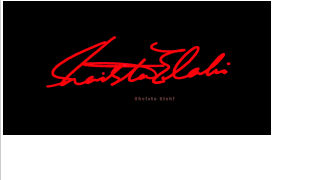
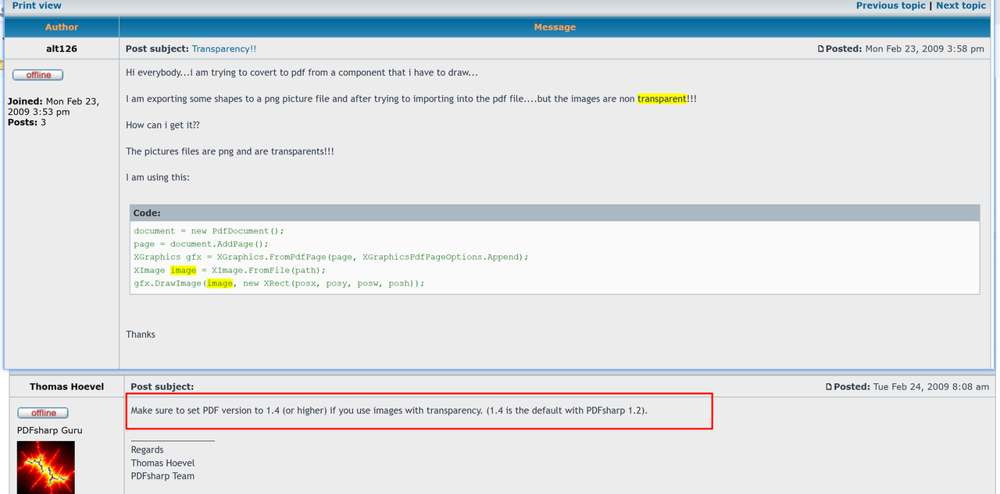
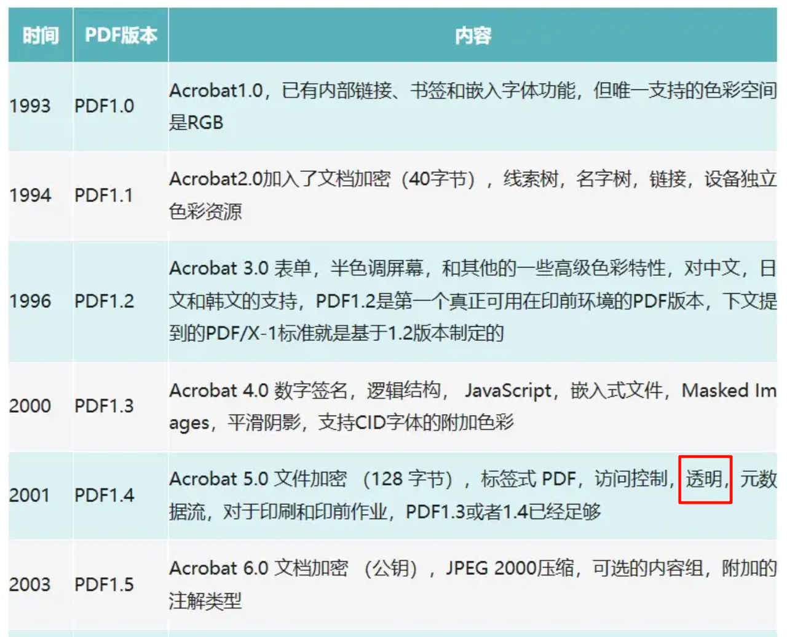
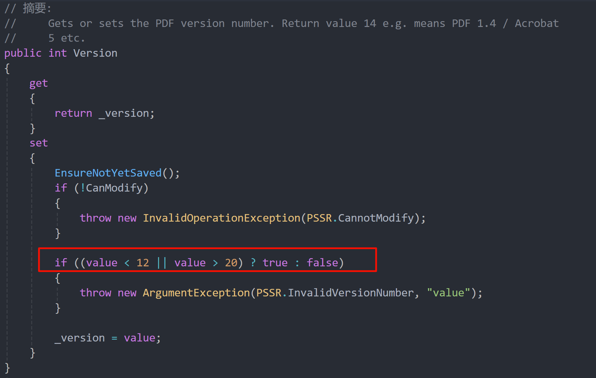

在处理PDF文档时，添加带有透明背景的图片是一个常见的需求，尤其是当我们需要在PDF中嵌入logo、图标或其他设计元素时。透明背景能够确保图片与PDF的背景完美融合，而不会出现不必要的白色背景。

## 前言

最近要实现一个为PDF添加签名图片（具有透明背景的PNG图片）的需求，由于是基于.NET平台编程，我使用了一个开源免费的PDF处理库：PDFSharp。然而，使用过程中出现了透明背景不生效的问题（实际表现背景被渲染为黑色）。经过一番研究后，找到了原因并成功解决，特此记录。

期望表现：


问题表现：


## 问题再现

```csharp
internal class Program
{
    static void Main(string[] args)
    {
        // 打开PDF文档
        var document = PdfReader.Open("D:\\test.pdf");
        // 绘图对象，document.Pages[0] 在文档第一页绘制
        XGraphics gfx = XGraphics.FromPdfPage(document.Pages[0]);
        // 图片
        XImage image = XImage.FromFile("D:\\MySign.png");
        // 画图，绘制在一个矩形区域
        gfx.DrawImage(image, new XRect(1, 1, 100, 50));
        // 保存
        document.Save("D:\\output.pdf");
        document.Dispose();
    }
}
```

使用该代码直接运行出现了之前描述的问题。一开始并不知道是什么原因，于是使用官网提供的示例代码进行测试，发现并没有问题，示例代码如下：

```csharp
// 主要区别
var document = new PdfDocument("D:\\new-test.pdf");
// 省略相同代码
// 保存
document.Close();
```

示例代码使用`new PdfDocument()`创建了一个新的PDF文档。主要区别就是前者是读取的存在的PDF，后者是创建的新的PDF，导致我一度单纯地以为对于读取存在的PDF都会出现这个问题（为了验证这个想法还浪费了很多时间）。

## 解决方案

通过搜索引擎和AI也没有得到解决方案，折腾了半天浏览了官方论坛，在里面找到了一条讨论贴，回复贴<mark>**指出PDF版本要高于1.4**</mark>。
> 原帖地址：https://forum.pdfsharp.net/viewtopic.php?f=2&t=656&hilit=Transparent+image 



于是我查看了不同方式创建的PDF版本：

```csharp
var document = PdfReader.Open("D:\\test.pdf");
Console.WriteLine(document.Version); // Output: 13

var document = new PdfDocument("D:\\new-test.pdf");
Console.WriteLine(document.Version); // Output: 17
```

发现 `Open` 方式的PDF版本为13，`new` 的PDF版本为17。于是我将Open的PDF版本设为了14，重新运行程序：

```csharp
internal class Program
{
    static void Main(string[] args)
    {
        var document = PdfReader.Open("D:\\test.pdf");
        // 更改版本
        document.Version = 14;
        
        XImage image = XImage.FromFile("D:\\MySign.png");
        XGraphics gfx = XGraphics.FromPdfPage(document.Pages[0]);

        gfx.DrawImage(image, new XRect(1, 1, 100, 50));
        
        document.Save("D:\\output.pdf");
        document.Dispose();
    }
}
```

运行之后，发现问题成功解决！
基于此，我继续做了一些尝试，并得到如下结果：
1. `Open + Version 13 => false`
2. `Open + Version 14 => true`
3. `new + Version 13 => false`
4. `new + Version 14 => true`

经过以上过程，可以确定是PDF版本问题，<mark>**在使用PDFSharp添加透明背景图片时需要检查PDF版本是否不低于14，否则会出现透明背景不生效的问题**</mark>。

## 更多讨论

起初并不了解PDF版本历史，检索学习到了一二：
> 致谢：https://zhuanlan.zhihu.com/p/559657455



通过查看PDFSharp源码，支持设置12-20之间的版本。



至此，问题已经解决，以后遇到特殊的需求需要检查PDF版本支持。